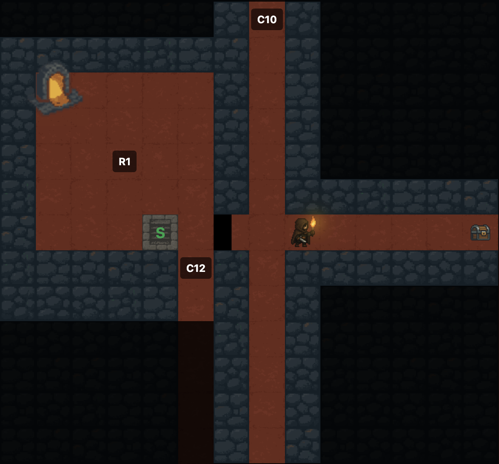
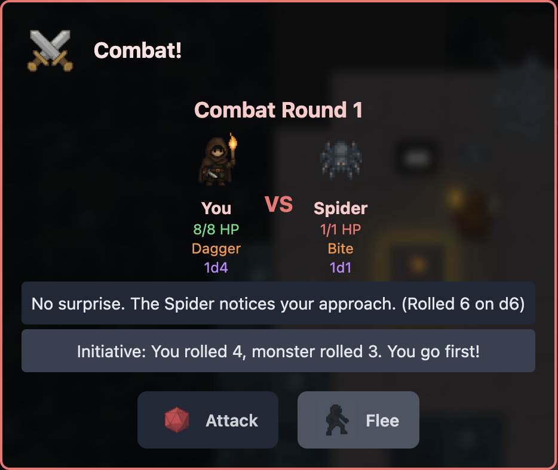
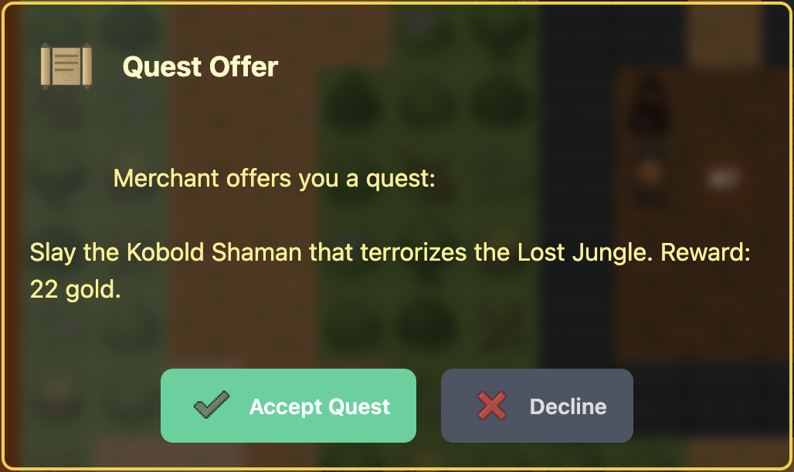
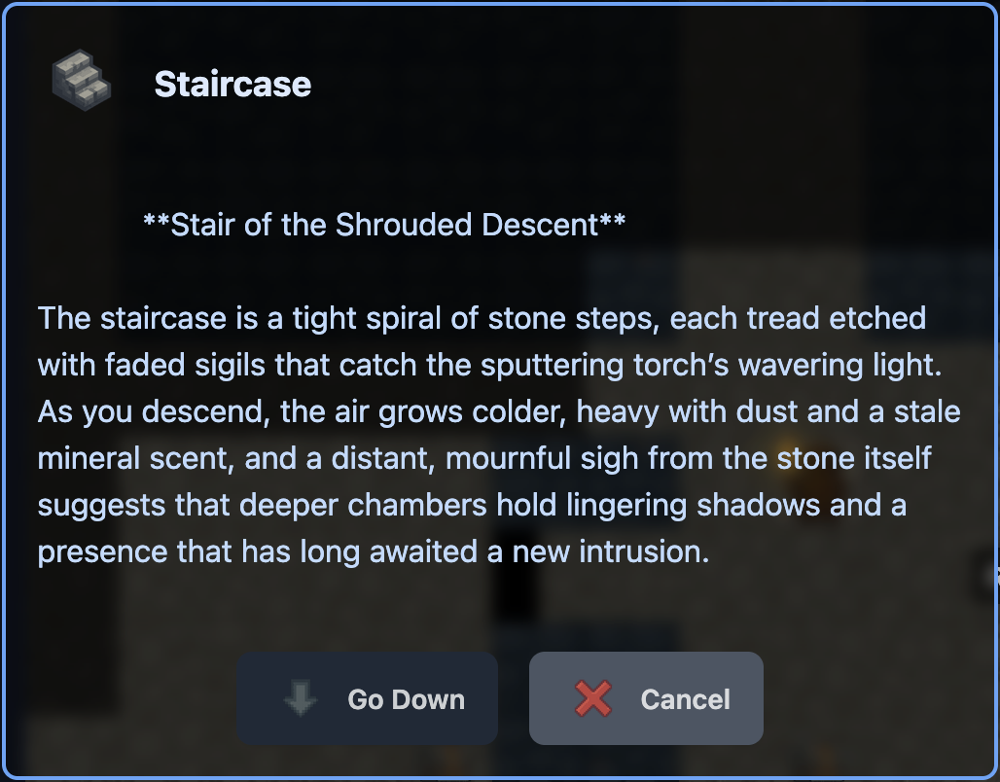
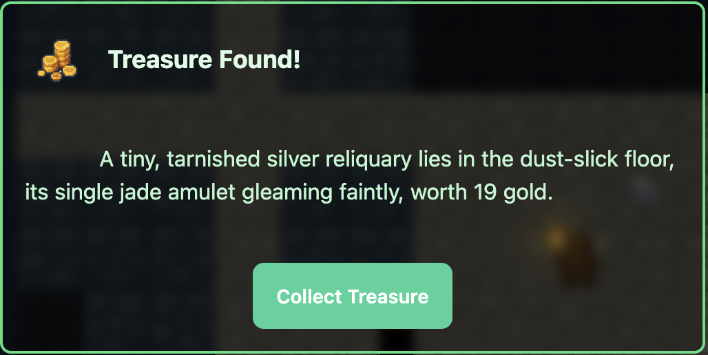
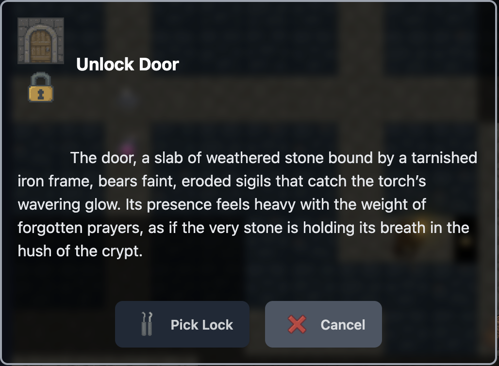

# 🏰 Dungeon Explorer

**Dungeon Explorer** is a retro, turn-based roguelike adventure game built in Elixir + Phoenix LiveView. Explore randomly generated dungeons, uncover magical treasures, engage in tactical combat, and complete quests—all in your browser!

This project was created from scratch (the hard way), with AI-assisted code generation over time, and continues to grow into a fully-fledged dungeon RPG with rich gameplay, immersive themes, and an old-school feel. No game engine—just raw code, LiveView, and imagination. 💡

---

## 🎮 Gameplay Features

- 🧱 **Procedural Map Generation**
  - Dungeons, caverns, outdoor, and cities
  - **Map themes:** one named preset per generated area (wall/floor art, fog, monster and feature spawn tables); features spawn in rooms but do not use separate per-room themes
  - Traps, locked doors, fountains, bookshelves, statues, and more

- 🌫️ **Fog of War & Light Radius**
  - Each **theme** sets `fog_type` (`dark`, `dim`, or `daylight`); limited visibility and torch radius apply when the theme is not daylight
  - Outdoor and some town themes use daylight-style visibility; many dungeons and caverns use dim or dark fog

- ⚔️ **Turn-Based Combat**
  - One action per turn: move, attack, or interact
  - Surprise attacks, evasion rolls, combat log narration

- 👁️ **Monsters & NPCs**
  - **100** monster entries with stats, behaviors, and spawn conditions (defined in `lib/dungeon/monster.ex`)
  - **`hunts_player?`** controls whether wandering monsters pursue the player; merchants, innkeepers, and similar use the same stat structs with encounter/dialog flows for services and rumors where applicable

- 📜 **Quests & Rumors**
  - Special features may reveal a rumor to track down a named item
  - Quest completion gives powerful loot and XP

- 💰 **Items & Inventory**
  - Healing potions, food, torches, loot, and magic items; wearables and combat bonuses come from the special-item list (plus base attack/AC from talents and level)
  - Wearable slots: weapon, torso, finger, back, container, etc.; the highest-XP item per slot counts for stats
  - Collected magic items are stored in an open-ended list—there is no inventory cap or Bag of Holding overflow logic (the Bag is equippable in the container slot like other gear, not extra capacity)

- 🗺️ **Map Print & PNG Export**
  - Printer-friendly and downloadable maps for VTT or archiving
  - Full map export includes explored tiles and feature overlays

- 🎧 **Sound FX**
  - Audio feedback for combat, movement, item use, door actions, etc.

- 💬 **LLM Integration (Optional)**
  - When enabled, a local [Ollama](https://ollama.com/) model can generate narrative text for encounters, rooms, quest beats, and related prompts (see `lib/dungeon/services/`)
  - Set `OLLAMA_MODEL` (and optionally `OLLAMA_HOST`, `OLLAMA_PORT`); use `OLLAMA_MODEL=none` to skip network calls and use built-in fallbacks

---

## 📚 How to Play

1. **Move with arrow keys/WASD or click a visible tile**
2. **Explore rooms**, search features, collect loot
3. **Fight monsters**, using attack, flee, or evade
4. **Follow quests** from discovered rumors
5. **Level up** with XP, gain talent boosts
6. **Descend stairs, use waypoints, or follow map exits** to reach new themed areas and tougher foes

---

## 🧪 Developer Setup

### ✅ Prerequisites

- **Elixir** `~> 1.14` (see [`mix.exs`](mix.exs); the repo [`.tool-versions`](.tool-versions) pins newer Erlang/Elixir for asdf-based local dev)
- **Phoenix** `~> 1.8` (resolved in [`mix.lock`](mix.lock), e.g. 1.8.x)
- **Node.js** — for npm dependencies under `assets/` (Heroicons, DaisyUI, Howler); CSS/JS bundling uses Mix tasks (`tailwind`, `esbuild`)
- **No database** — the app supervision tree does not start Ecto or a repo

### ▶️ Run Locally

```bash
# JavaScript/CSS dependencies (Howler, Tailwind plugins, etc.)
(cd assets && npm install)

# Elixir deps + Tailwind/esbuild installers + asset build
mix setup

# Start the server (dev)
mix phx.server
```

`mix setup` runs `deps.get`, installs Tailwind/esbuild via Mix if missing, and builds assets; it does **not** run `npm install`, so keep the `assets/` step above.

For a **production-style asset pipeline** (minified Tailwind/esbuild + `phx.digest`), run `mix assets.deploy` from the project root after `npm install` in `assets/` (there is no `npm run deploy` in this repo).

Now visit [`localhost:4000`](http://localhost:4000) in your browser! 🌐

---

## 🔬 Technical Architecture

- 🧠 **LiveView-Driven State**
  - Game state stored in LiveView socket assigns
  - One main [`dungeon_live.ex`](lib/dungeon_web/live/dungeon_live.ex) plus **19** supporting modules under [`dungeon_live/`](lib/dungeon_web/live/dungeon_live/) for combat, movement, fog, quests, and related systems

- 🗺️ **Tile-based Rendering**
  - HEEX templates render dynamic grid map
  - Tile data includes fog, items, monster overlays, etc.

- 📐 **Pathfinding**
  - A* pathfinding in the browser (`PathfindingHook` in `assets/js/app.js`) feeds click-to-move; server-side movement validates each step

- 🔀 **Procedural Generation**
  - Traditional dungeons: random rectangular **rooms** and **corridors** (`generator/rooms.ex`, `corridors.ex`); separate flows for **caverns**, **outdoor**, and **cities**
  - Map **themes** (from `themes.ex`) pick wall/floor art, fog style, and weighted monster/feature pools
  - Shared **features** placement and terrain helpers under `lib/dungeon/generator/`

- 🔊 **Audio System**
  - Sound effects for combat, movement, items, and exploration
  - MP3 audio files triggered by game events

- 🤖 **Optional AI Support**
  - Ollama integration described above; prompts live under `lib/dungeon/services/` (`DescriptionService`, `OllamaClient`)

- 📊 **Game data in code**
  - Monsters and special (magic) items are defined in [`lib/dungeon/monster.ex`](lib/dungeon/monster.ex) and [`lib/dungeon/special_item.ex`](lib/dungeon/special_item.ex)
  - [`priv/static/data/`](priv/static/data/) holds CSV mirrors of some definitions for spreadsheets or tooling; the running app does not load those CSV files

---


## 📁 Project Structure Highlights

| Folder/File | Purpose |
|-------------|---------|
| `lib/dungeon_web/live/dungeon_live.ex` | Main game LiveView orchestrator |
| `lib/dungeon_web/live/dungeon_live/` | 19 specialized game system modules (combat, movement, fog, traps, etc.) |
| `lib/dungeon/generator.ex` | Procedural generation entry point |
| `lib/dungeon/generator/` | Sub-generators: rooms, corridors, caverns, outdoor, cities, features |
| `lib/dungeon/services/` | AI integration and description services |
| `lib/dungeon/monster.ex` | Monster definitions and behavior |
| `lib/dungeon/player_stats.ex` | Player character and progression |
| `lib/dungeon/quest.ex` | Quest system and special item logic |
| `lib/dungeon/themes.ex` | Map themes and feature spawning |
| `priv/static/images/` | Tile sprites and UI assets (hundreds of PNGs) |
| `priv/static/audio/` | Sound effects for game events |
| `priv/static/data/` | CSV exports (not read at runtime; see `monster.ex` / `special_item.ex`) |
| `docs/` | Game rules (`GAME_RULES.md`) and pathfinding notes (`PATHFINDING.md`) |

---

## 🧪 Run Tests

```bash
mix test
```

Some modules (like combat, item parsing, dice rolling) include unit tests.

---

## 🖼️ Screenshots



*Explore procedurally generated dungeons in this retro roguelike built with Elixir and Phoenix LiveView*

### More screenshots











---

## 📜 License & Credits

Licensed under the [MIT License](LICENSE). See also [CONTRIBUTING.md](CONTRIBUTING.md) and [SECURITY.md](SECURITY.md).

Created by Bruce Zawadzki with assistance from AI and the Elixir community. Art and sound assets are custom or open source. Contact for collaboration or feedback!

---

🧭 **Enjoy your adventure!**  
